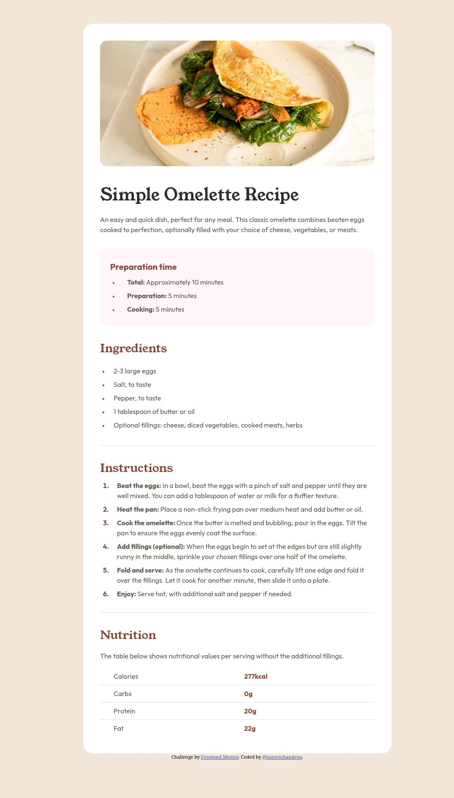
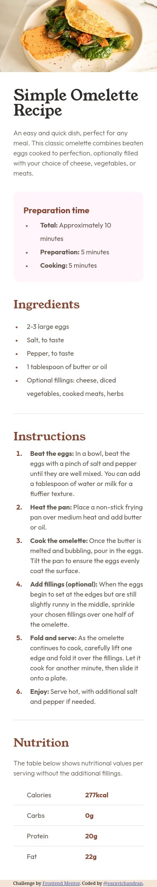

# Frontend Mentor - Recipe page solution

This is a solution to the [Recipe page challenge on Frontend Mentor](https://www.frontendmentor.io/challenges/recipe-page-KiTsR8QQKm). Frontend Mentor challenges help you improve your coding skills by building realistic projects.

## Table of contents

- [Overview](#overview)
  - [The challenge](#the-challenge)
  - [Screenshot](#screenshot)
  - [Links](#links)
- [My process](#my-process)
  - [Built with](#built-with)
- [Author](#author)
- [Acknowledgments](#acknowledgments)

## Overview

### Screenshot

The screenshot of my solution.

### Links

- Solution URL: [Receipe page](https://github.com/earavichandran/recipe-page)
- Live Site URL: [Receipe page - Vercel site](https://recipe-page-rho-blush.vercel.app/)

## My process

### Built with

- Semantic HTML5 markup
- CSS custom properties
- Flexbox

## Author

- Github Account - [@earavichandran](https://www.github.com/earavichandran)
- Frontend Mentor - [@earavichandran](https://www.frontendmentor.io/profile/earavichandran)

## Acknowledgments

I sincere thanks to

- Frontend Mentor
- Traversy Media
- Kevin Powell Youtube channel

Learned many things from their videos
